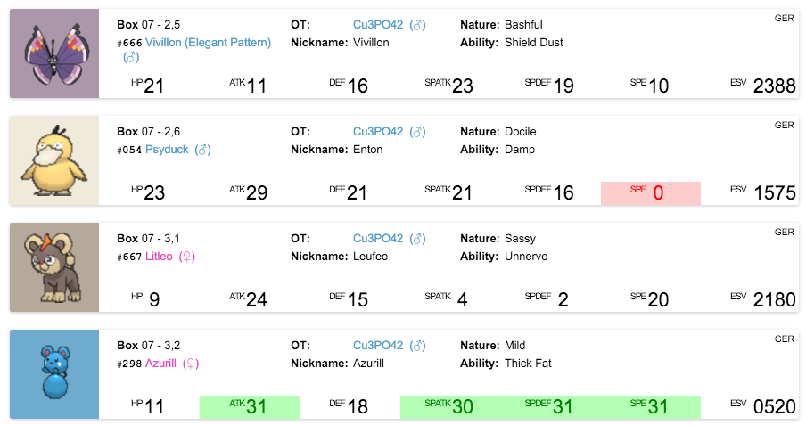

# KeySAVe

So you decided you want or need KeySAV. But there are so many different ones, which one should you use? I promise, KeySAVe (*pronounced* Key-SAV-e) is the best KeySAV I ever made and I think it's also better than any other versions I'm aware of. Here's why:

  * No saving twice required.
  * Compatible with all legacy KeySAV2 data and keys.
  * Cross platform. Yes, it runs natively on Mac, Windows and Linux.
  * Pretty output. See for yourself.  And generally good looking.
  * Compatible with all format strings from KeySAV2 (any version).
  * Powerful new formatting system. Use either [Handlebars templates](formatting/handlebars.md) or, for the developers among you, even [write your own](formatting/api-docs.md) formatting plugin with [React](https://facebook.github.io/reactjs).
  * Great [filters](/filters.md) so you can find just what you are looking for. You can even use custom JavaScript to do your filtering.
  * A well tested () decryption core.
  * An auto updater so you always get the newest features automatically!
  * Did I say it was cross platform?
  * And a great documentation ;)

Now that you're convinced, let's [get started](getting-started.md).  
