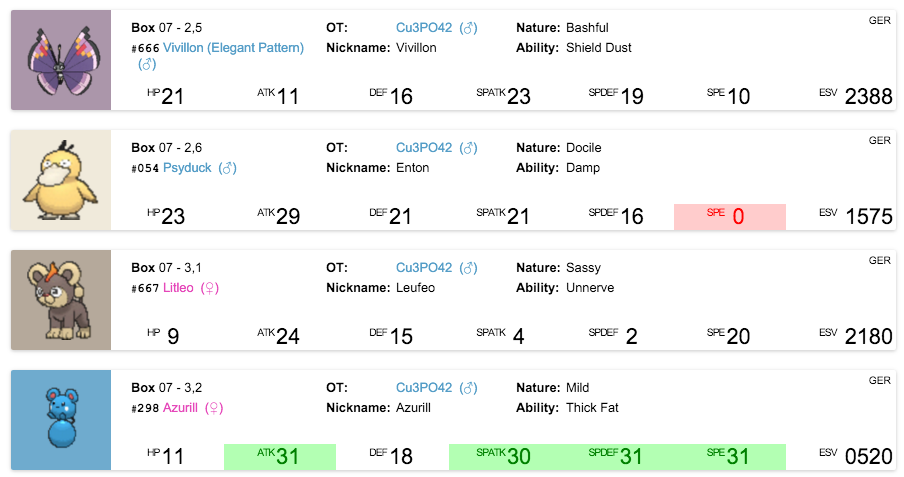

# The Pretty Formatting Plugin

There really isn't much to be said about this plugin. It shows a Pokémon's

  * Species
  * Dex number
  * Nickname
  * Gender
  * OT (Name and Gender)
  * Ability
  * Nature
  * IVs (along with highlights if they are good or bad)
  * ESV
  * Language Tag
  * and a sprite!

You can configure it to not show Pokémon that might be *ghosts* (read more about that [here](../dumping/encrypted-saves.md#ghosts)), show them or mark them by darkening their cards.

In the future ball and held item, as well as other info might be shown. If you have an opinion on that, please [leave me feedback]()!


